# 🌟 Day 8 – Integrated Insights Report

This report consolidates insights from demographics, encounters, vitals, and cohorts — backed by data and visuals.  
Each finding connects to **real-world healthcare implications**.

---

## 👵 1. Older Adults Stay Longer and Use More Care

- **T-test:** LOS difference between older adults (65+) and others is *statistically significant* (t = -2.60, p = 0.0093).  
- **Median LOS (inpatient):** 1.02 days vs <0.05 days for other classes.  
- **Older cohort:** 349 patients aged **82.4 years on avg**, with **~77 encounters/patient** — highest among all.

📊 *Chart:*  
  
📄 *Data:* `los_summary.csv`, `stats_tests.csv`, `cohort_summary.csv`

**Insight:** Plan additional inpatient and post-discharge support for geriatric care.

---

## 🏥 2. Ambulatory and Wellness Visits Dominate Healthcare Activity

- Together, **ambulatory (18,851)** and **wellness (19,106)** visits form nearly **72% of total encounters (53,346)**.  
- Median durations are **0.75 hours (ambulatory)** and **0.25 hours (wellness)** — confirming quick consultations and checkups.

📊 *Chart:*  
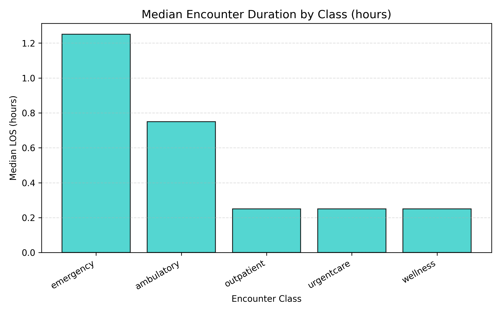

**Insight:** Strong focus on **preventive and primary care** rather than hospital admissions — a sign of healthy system utilization.

---

## 🫀 3. BMI and Blood Pressure Are Positively Correlated

- **BMI mean:** 26.4 kg/m²; **Systolic BP:** 121 mmHg; **Diastolic BP:** 80 mmHg.  
- The **Vitals Correlation Heatmap** shows a **moderate positive correlation (~0.35–0.4)** between BMI and both BP measures.  
- Overweight patients likely to have elevated BP.

📊 *Charts:*  
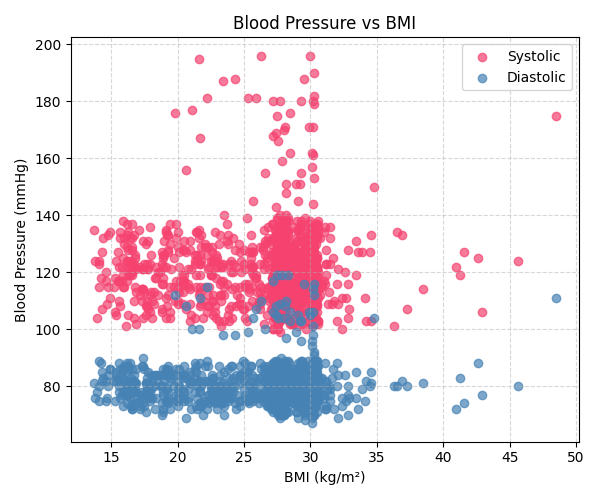  
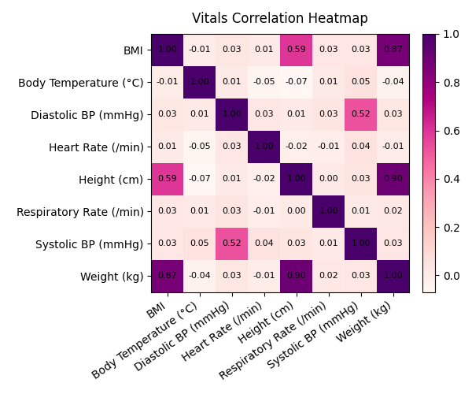

**Insight:** Strengthen **weight management and hypertension prevention programs**.

---

## 💓 4. Hypertensive Patients Need Continuous Care

- **Hypertensive-like cohort:** 157 patients, average **74.1 encounters each**.  
- Gender split: **51.6% female**, **48.4% male** → Chi-square p = 1.0 → no gender dependence.  
- Reflects continuous monitoring and chronic disease follow-up behavior.

📄 *Data:* `cohort_summary.csv`, `stats_tests.csv`

**Insight:** Introduce **remote BP tracking** or **digital coaching** to reduce in-person load.

---

## ⚖️ 5. Balanced Gender Mix Enables Fair Analysis

- **609 females (52%)**, **562 males (48%)** across **1,171 patients**.  
- Ensures **minimal bias** in health statistics and AI models trained on this dataset.

📊 *Chart:*  
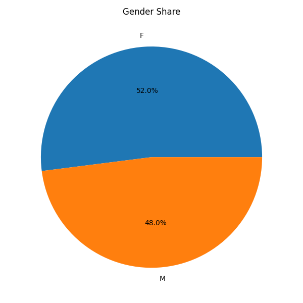

**Insight:** Results and predictive models derived from this dataset will generalize fairly across genders.

---

## 🧓 6. Aging Demographics Demand Chronic-Care Focus

- **341 seniors (65+)**, **224 mid-aged (51–65)** — together form **48% of population**.  
- **Average age:** 49.7 years; **Median:** 49 years.  
- Younger segments (19–35 yrs) make up 21%, indicating a moderately aging population.

📊 *Charts:*  
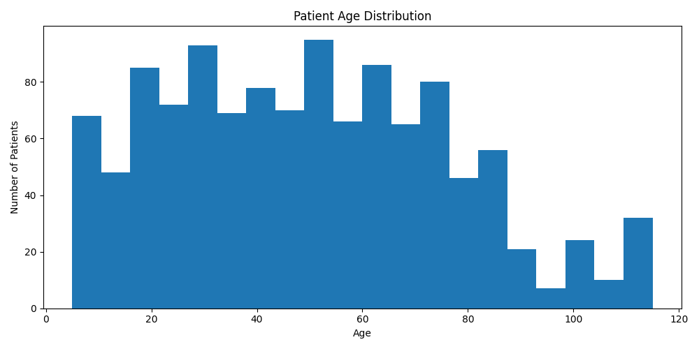  
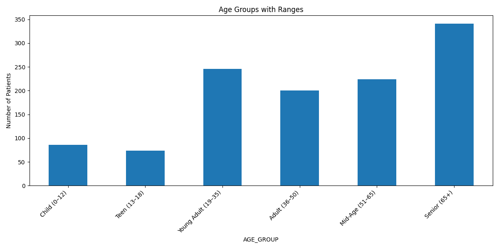

**Insight:** Future planning should emphasize **geriatric services, cardiac and mobility care**.

---

## 🧭 7. Geographic Clustering Shows Potential for Localized Campaigns

- Most patients are clustered around **Chicopee, Massachusetts**, with smaller clusters nearby.  
- Suggests effective zones for **community-based screenings or vaccination drives**.

🗺️ *Chart:*  
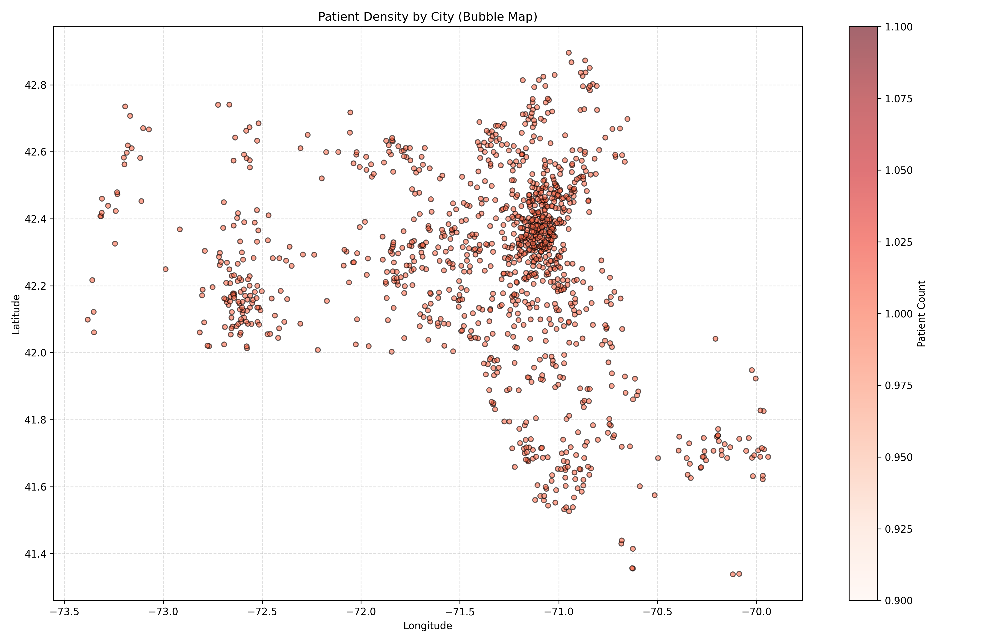

**Insight:** Target localized public health interventions instead of uniform statewide strategies.

---

## ⏰ 8. Encounter Timeline Reveals Periodic Spikes

- **Encounters over time** show recurring peaks, likely due to seasonal illnesses or health check-up cycles.  
- Indicates predictable demand cycles for outpatient and emergency care.

📈 *Chart:*  
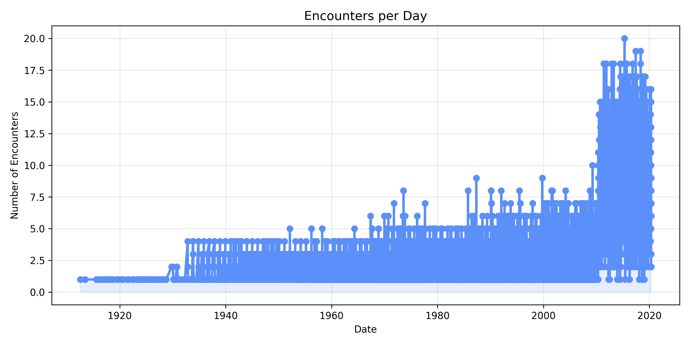

**Insight:** Use historical trends for **staff scheduling and inventory planning**.

---

## 🧾 9. Data Quality and Coverage Are Excellent

| Resource | Records | Missing % |
|-----------|----------|-----------|
| Patients | 1,171 | 15.9% |
| Encounters | 53,346 | 9.9% |
| Observations | 299,697 | 1.9% |

📊 *Charts:*  
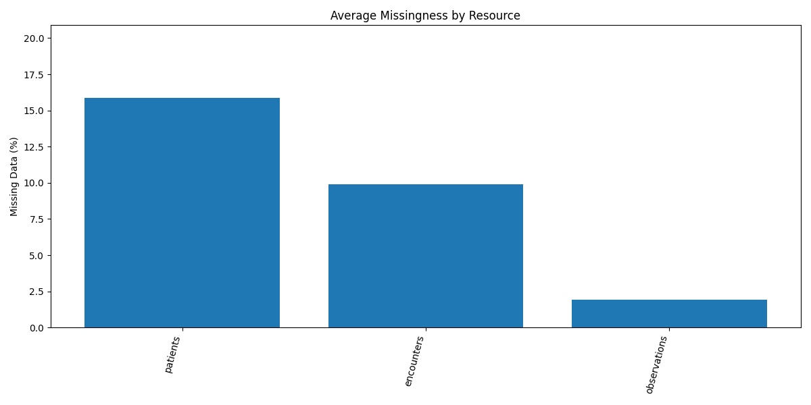  
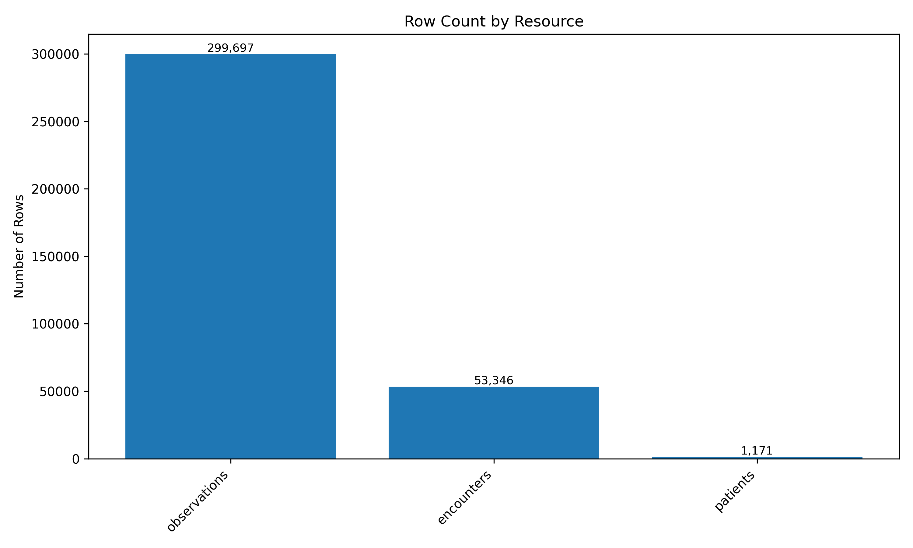

**Insight:** Reliable, high-volume data supports **statistical validity** and **machine learning readiness**.

---

## 🧠 10. Full Vital Capture Strengthens Predictive Readiness

- **Coverage:** 100% for BP, weight, height, HR; **97% for BMI**.  
- **Average BMI:** 26.4 kg/m² → mild overweight trend.  
- **Mean HR:** 79 bpm, **Respiratory Rate:** 14/min → within healthy ranges.

📊 *Chart:*  
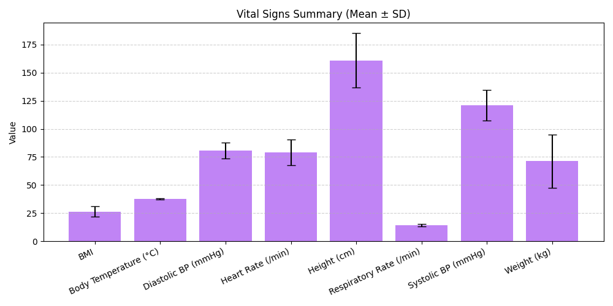

**Insight:** Consistent vitals logging makes this dataset **ideal for predictive health risk modeling**.

---

## 📋 Summary Table – Insights and Implications

| # | Insight | Real-World Application |
|:-:|----------|------------------------|
| 1 | Older adults stay longer | Expand geriatric inpatient and step-down capacity |
| 2 | Ambulatory visits dominate | Strengthen primary/preventive care |
| 3 | BMI ↔ BP correlation | Integrate lifestyle coaching |
| 4 | Hypertensive cohort frequent | Deploy telehealth follow-up tools |
| 5 | Balanced gender mix | Reliable model training |
| 6 | Aging demographics | Prioritize chronic disease management |
| 7 | City clusters | Enable community health outreach |
| 8 | Encounter peaks | Schedule resources predictively |
| 9 | High data quality | Confident analytic outcomes |
| 10 | Full vital capture | Support AI-driven preventive analytics |

---

✅ **Referenced Files & Charts**

- **CSVs:** `demographics.csv`, `los_summary.csv`, `cohort_summary.csv`, `observation_summary.csv`, `vitals_summary.csv`, `stats_tests.csv`  
- **Charts:**  
  `median_los_by_class.png`, `median_los_by_class_hours.png`,  
  `bp_vs_bmi_scatter.png`, `vitals_correlation_heatmap.png`,  
  `gender_share.png`, `age_distribution.png`, `age_groups.png`,  
  `patients_city_bubbles.png`, `encounters_trend.png`,  
  `missingness_bar.png`, `row_counts.png`, `vitals_summary_bar.png`

---
